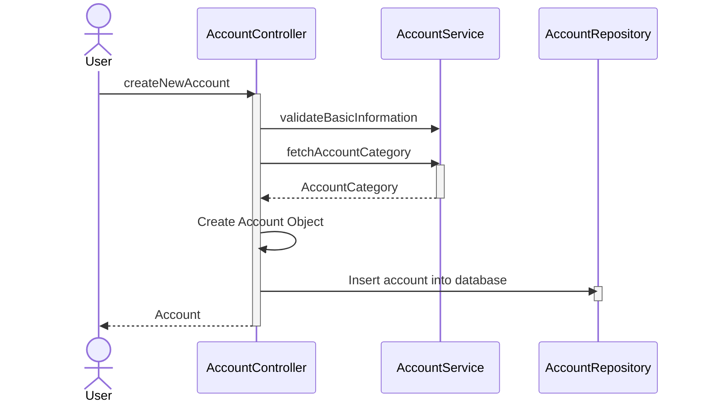

## Updated readme

Hello! I know this wasn’t required, but I thought it would be fun to properly fix the code.
I noted a few areas in the code where I believe improvements could be made. I didn’t add anything to the repo that wasn’t discussed during the interview. This is to demonstrate what I was describing in case my explanation wasn’t fully clear.
I also didn’t include unit tests, as I set myself a time limit and didn’t want to spend my full Sunday digging through compatible Java 11 testing setups.

- I placed all the 'external' calls to other services in a separate folder.
- The call to credit score is done using a gateway. This way, the credit score service can be easily replaced in the future by another service.
- The different tables that stored accounts (ivory, silver, gold) I brought together in a single table. This way, it's easier to query the database 
for all accounts and if a user needs the account type to be adjusted, it would be less complex.
- I added improvement notes in the javadocs of the classes for more detail.

Here is a High-Level Diagram of the application, please note that this flow isn't all the calls made; but it should give you an idea of the structure:
## Account Creation Flow

---------------
**Requirements given to junior**

 - Create a bank account service to handle the creation of new accounts.

 - The service should take the following inputs:
    - First Name: cannot be null or empty
    - Last Name: cannot be null or empty
    - Fiscal code (to uniquely identify the person e.g. social security/PPS number): must be 13 digits long
    - Birth date: must be at least 18 years ago

 - The service should call an external service (CreditScoreService) in order to get the credit score for a given user.

 - The credit score should determine what sort of account the user can get:
   - BAD: Ivory account (no credit)
   - GOOD: Silver account (1000 euro credit)
   - EXCELLENT: Gold account (5000 euro credit)

 - The account should be given a unique identifier, and must be persisted in order to be queried at a later date.

 - The user should be returned all information related to the account: ID, first name, last name, fiscal number, birth date, credit score, account type and their credit limit.